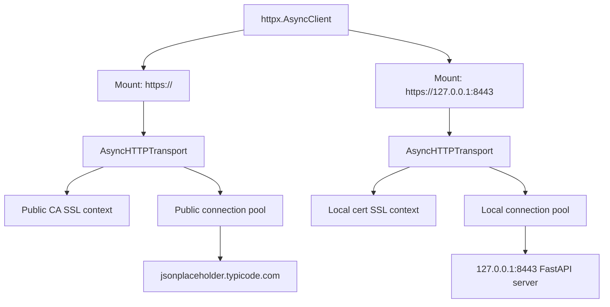

# custom-certs

Small FastAPI HTTPS lab for checking how `httpx.AsyncClient` behaves with public TLS and a local self-signed certificate.

## Setup

```bash
uv sync
uv run generate-cert
```

## Run

Start the HTTPS server:

```bash
uv run run-server
```

In another terminal run the client:

```bash
uv run run-client
```

## What the client does

The client uses one `httpx.AsyncClient` with `mounts`:

- `https://127.0.0.1:8443` uses a transport that trusts `certs/localhost.crt`
- `https://` uses a transport that trusts the normal public CA bundle from `certifi`

So one client object routes requests to different transports.

## Mermaid diagram



This illustrates the key point:

- the same top-level client is used for both requests
- different SSL contexts work because the client routes by mount
- each mounted transport has its own pool and SSL configuration

## Observed behavior

Running the sample produced:

```text
mounted client ssl test
public: 200
local: 200
done
```

This shows that the same `httpx.AsyncClient` can successfully call both endpoints even though they require different SSL trust settings.

## Important detail about the pool

The important result is:

- from the caller point of view, the same client works for both requests
- the client can use different SSL contexts for different destinations
- this works because `mounts` route requests to different transports
- each mounted transport has its own SSL context and its own HTTP connection pool

So the same top-level client works across different SSL contexts, but not by reusing one single underlying pool for all destinations.

## Conclusion

- A single plain `httpx` transport/pool does not switch SSL context per request.
- A single `httpx.AsyncClient` can still work with different SSL contexts by using `mounts`.
- In practice, the same client can talk to both endpoints, but the SSL separation happens at the mounted transport/pool level.

## Files

- `server.py` — FastAPI app
- `generate_cert.py` — creates the self-signed certificate
- `run_server.py` — starts uvicorn with TLS
- `client.py` — async client test