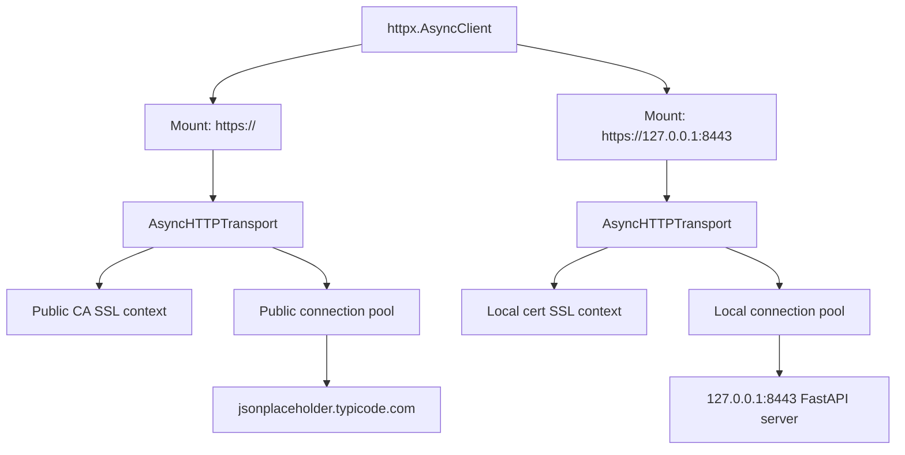

# custom-certs

Small FastAPI HTTPS lab for checking how `httpx.AsyncClient` behaves with public TLS and a local self-signed certificate.

## Setup

```bash
uv sync
uv run generate-cert
```

## Run

Start the HTTPS server:

```bash
uv run run-server
```

In another terminal run the client:

```bash
uv run client.py
```

## What the client does

The client uses one `httpx.AsyncClient` with `mounts`:

- `https://127.0.0.1:8443` uses a transport that trusts `certs/localhost.crt`
- `https://` uses a transport that trusts the normal public CA bundle from `certifi`

So one client object routes requests to different transports.

The client also patches `ssl.create_default_context` in `ctx.py` to count how many default SSL contexts are created during the run.

## Mermaid diagram



This shows the important point:

- the same top-level client is used for both requests
- different SSL contexts work because the client routes by mount
- each mounted transport has its own pool and SSL configuration

## Observed behavior

Latest run output:

```text
PID 522092 SSL Context Created 0.0009072760003618896
PID 522092 SSL Context Created 0.0019557740015443414
mounted client ssl test
iter 1 public: 200
iter 1 local: 200
iter 2 public: 200
iter 2 local: 200
iter 3 public: 200
iter 3 local: 200
iter 4 public: 200
iter 4 local: 200
iter 5 public: 200
iter 5 local: 200
iter 6 public: 200
iter 6 local: 200
iter 7 public: 200
iter 7 local: 200
iter 8 public: 200
iter 8 local: 200
iter 9 public: 200
iter 9 local: 200
iter 10 public: 200
iter 10 local: 200
done
default ssl contexts created: 2
```

## What this means

- the same `httpx.AsyncClient` successfully made all 20 requests
- public requests used the public CA transport
- local requests used the local self-signed-cert transport
- only 2 default SSL contexts were created for the whole run
- those 2 contexts were reused across all 10 iterations

## Conclusion

- A single plain `httpx` transport/pool does not switch SSL context per request.
- A single `httpx.AsyncClient` can still work with different SSL contexts by using `mounts`.
- In this setup, the same client works for both endpoints.
- The SSL separation happens at the mounted transport/pool level.
- The observed run shows that the contexts are created once and reused.

## Files

- `server.py` — FastAPI app
- `generate_cert.py` — creates the self-signed certificate
- `run_server.py` — starts uvicorn with TLS
- `client.py` — async client test
- `ctx.py` — patches `ssl.create_default_context` and counts created contexts
