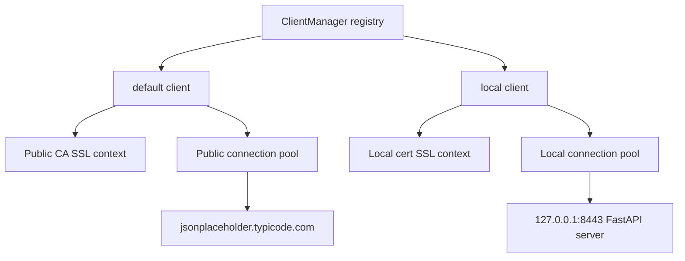

# custom-certs

Small FastAPI HTTPS lab for checking how `httpx.AsyncClient` behaves with public TLS and a local self-signed certificate.

## Setup

```bash
uv sync
uv run generate-cert
```

## Run

Start the HTTPS server:

```bash
uv run run-server
```

In another terminal run the client:

```bash
uv run client.py
```

## Current approach

The current client uses a small registry-style manager:

- one default `AsyncClient` is created for normal public HTTPS traffic
- when a different trust configuration is needed, a new named client is created and cached
- later calls can reuse that named client instead of rebuilding it every time

This avoids mutating private `httpx` internals such as `_mounts`.

## Registry idea

The client keeps a dictionary of clients keyed by context name.

- `"default"` → client using the normal public CA bundle
- `"local"` → client using the self-signed local certificate

Conceptually it works like this:

```python
client = await manager.get_client("default")
await client.get("https://jsonplaceholder.typicode.com/todos/1")

client = await manager.get_client(
    "local",
    verify=ssl.create_default_context(cafile="certs/localhost.crt"),
)
await client.get("https://127.0.0.1:8443/health")
```

## Mermaid diagram



## Observed behavior

Latest run output:

```text
PID 525400 SSL Context Created 0.0039573299982293975
client manager ssl test
public: 200
local before new client: ConnectError
PID 525400 SSL Context Created 0.0022826179992989637
local after new client: 200
default ssl contexts created: 2
```

## What this shows

- the default client works for the public HTTPS endpoint
- the same default client fails for the local self-signed endpoint
- creating a second registered client with the local trust makes the local request succeed
- two default SSL contexts were created during the run
- each SSL context is tied to its own client and connection pool

## Usage notes

1. Start the local server:
   ```bash
   uv run run-server
   ```

2. Run the client:
   ```bash
   uv run client.py
   ```

3. Read the output:
   - `public: 200` means the default public client worked
   - `local before new client: ConnectError` means the public-trust client cannot verify the self-signed cert
   - `local after new client: 200` means the registered local-trust client worked

## Conclusion

The safe approach is not to force one pool to switch SSL contexts dynamically.

Instead:

- keep a registry of `AsyncClient` instances
- create one client per SSL/trust configuration
- reuse clients by context name

That gives you predictable behavior and keeps connection pooling per SSL context.

## Files

- `server.py` — FastAPI app
- `generate_cert.py` — creates the self-signed certificate
- `run_server.py` — starts uvicorn with TLS
- `client.py` — async client test using the registry approach
- `ctx.py` — patches `ssl.create_default_context` and counts created contexts